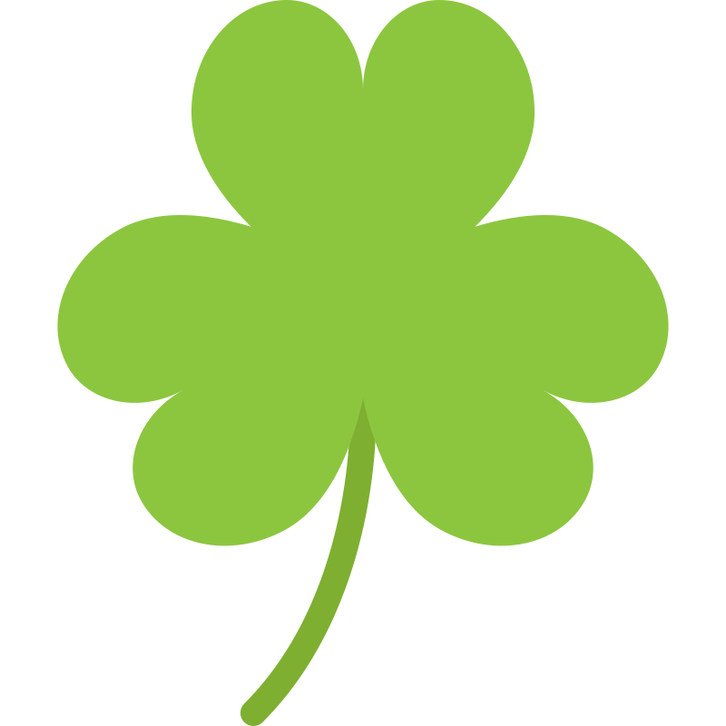
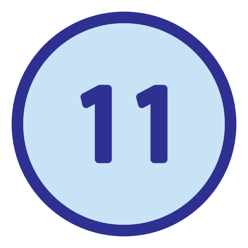
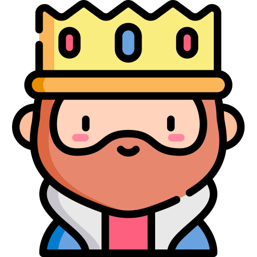
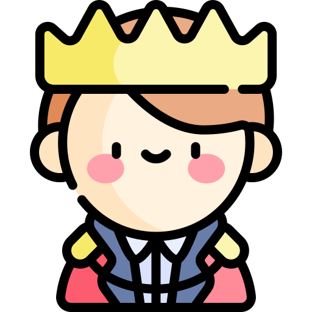
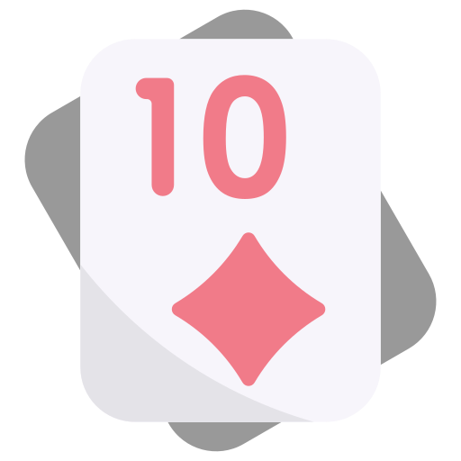
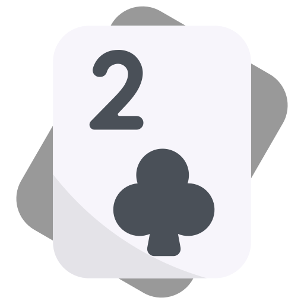
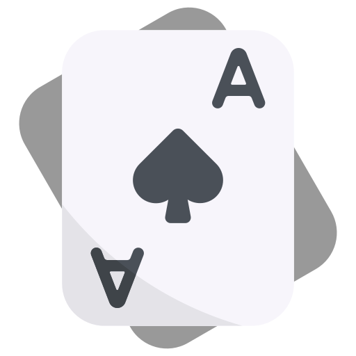
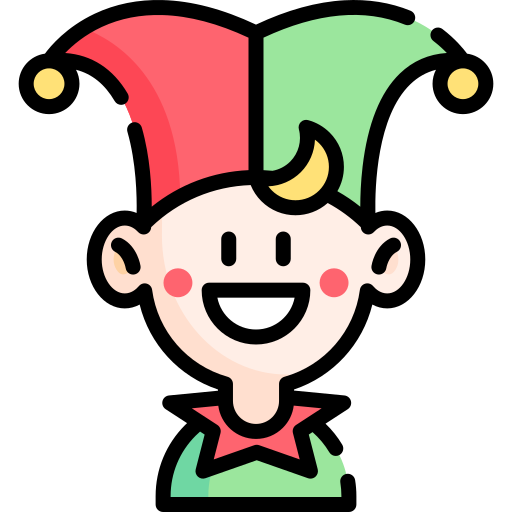

#  Eleven

Are you ready to master the art of 11?  
Match cards to outplay the bot in a race to 104 points!

[Play here!](https://linkHere)

## Rules

#### Objective
 Collect flop cards and be the first to score 104 points!

#### Gameplay
On your turn, play one of your hand cards with one or more flop cards to collect them:

 Create a sum of 11 with your selected card and flop cards to collect.  
 King collects King.  
 Queen collects Queen.  
 Jack collects all flop cards except Kings and Queens.

If no moves are available, drop a card.  
At the end of each round, the last player to collect flop cards gets all remaining flop cards.

**Example moves:**
- Play a 5, collect a 6 from the flop.
- Play a 3, collect a 7 and an Ace from the flop.

#### Round Scoring
26 points are available each round:

 Collect most club suit cards (7+ clubs) - 13 points.  
 Ten of diamonds - 3 points.  
 Two of clubs - 2 points.  
 Jack (any suit) - 1 point.  
 Ace (any suit) - 1 point.  
 **Bonus** - clear the flop (except for the last round, not using a jack) - 5 points.

## What's inside
 &nbsp;[React](https://react.dev/) for UI components.  
 &nbsp;[TypeScript](https://www.typescriptlang.org/) for type safety.  
 &nbsp;[XState](https://xstate.js.org/) for managing game state.  
 &nbsp;[Framer Motion](https://motion.dev/) for smooth animations.  
 &nbsp;[Styled-Components](https://styled-components.com/) for components styling.  

## Development
Install [NodeJS](https://nodejs.org/en/download/)  

    git clone https://github.com/roiko20/eleven-card-game

    cd eleven-card-game

    npm install

    npm run watch
Visit [localhost:3000](http://localhost:3000)  

---

